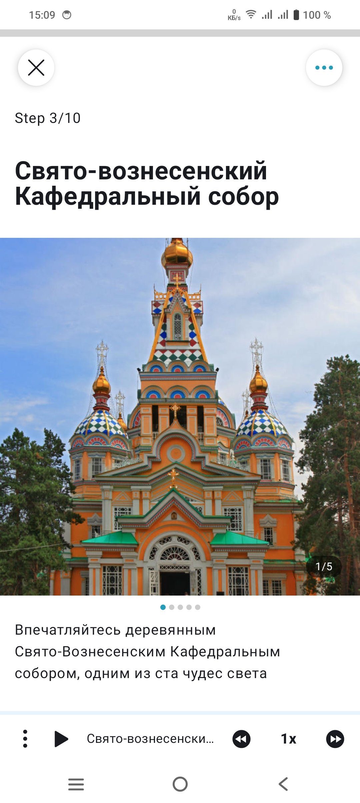
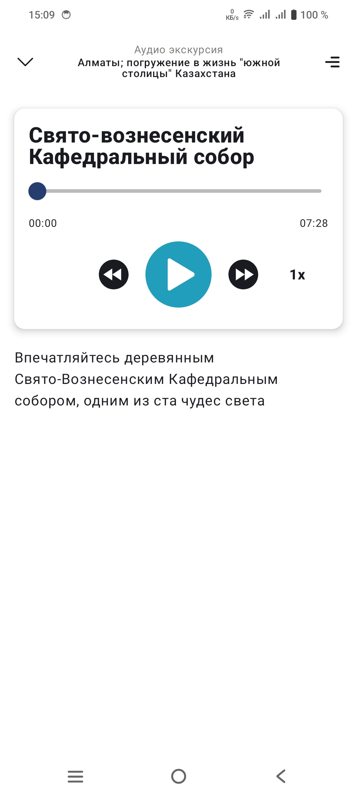

# WeGoTrip Test

Тестовое задание для WeGoTrip - аудио-плеер для экскурсий с функцией отображения изображений достопримечательностей.

## Технологии и архитектура

- Kotlin
- Jetpack Compose
- Clean Architecture
- MVI
- Hilt для DI
- Coroutines & Flow
- Coil для загрузки изображений

## Основной функционал

- Воспроизведение аудио с возможностью паузы
- Перемотка вперед/назад на 5 секунд
- Регулировка скорости воспроизведения (0.5x, 1x, 1.5x, 2x)
- Слайдер прогресса воспроизведения
- Слайдер изображений с индикатором
- Расширяемый нижний sheet с детальной информацией
- Мини-контроллер в свернутом состоянии

## Структура проекта

- **:app** - Main Application модуль
- **:data** - Реализация репозиториев и data sources
- **:domain** - Бизнес логика, модели и use cases
- **:presentation** - UI компоненты и ViewModels

## Требования

- Android Studio Hedgehog | 2023.1.1
- Минимальная версия SDK: 25
- Целевая версия SDK: 35

## Скриншоты

<table>
  <tr>
    <td></td>
    <td></td>
    <td></td>
  </tr>
</table>

Установка
Вы можете скачать последнюю версию приложения из папки apk/app-release.apk

